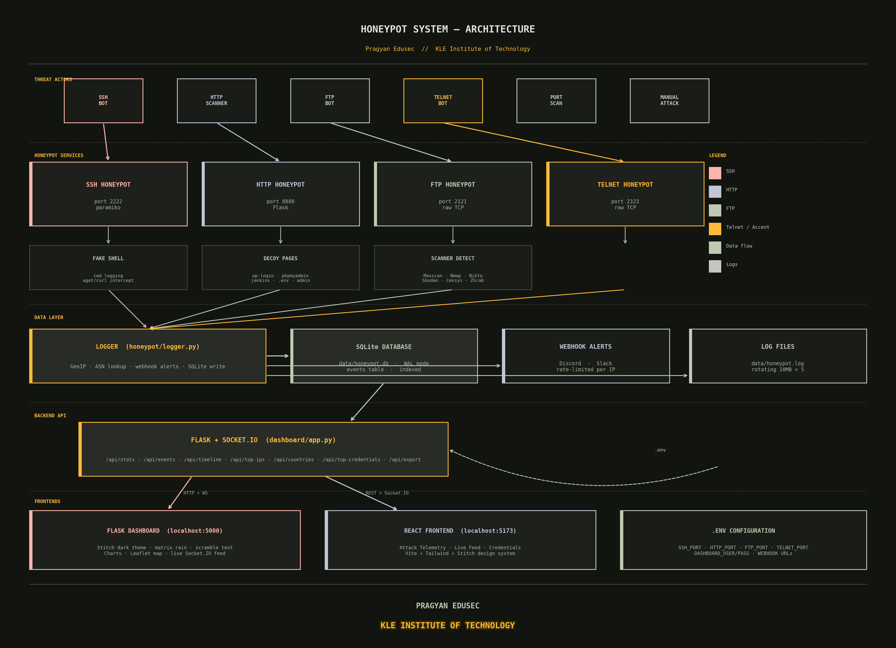

# Honeypot System

> **Pragyan Edusec** &nbsp;|&nbsp; Internship Project &nbsp;&mdash;&nbsp; **KLE Institute of Technology**

A professional-grade multi-service honeypot that emulates SSH, HTTP, FTP, and Telnet servers to capture, log, and visualise real-world attack traffic in real time. All events are stored in a local SQLite database and displayed on a live threat-intelligence dashboard with Socket.IO push updates.

---

## Architecture Diagram



---

## Features

- **SSH Honeypot** — presents an OpenSSH banner, accepts auth, and drops attackers into a fully interactive fake shell; logs every command typed, including malware download URLs (`wget`/`curl`)
- **HTTP Honeypot** — serves convincing fake pages (WordPress, phpMyAdmin, Jenkins, Jupyter, Laravel, admin panels, `.env` files) and fingerprints 13 known scanner tools
- **FTP Honeypot** — captures `USER`/`PASS` credential attempts (default port 2121; set `FTP_PORT=21` with `sudo` for standard)
- **Telnet Honeypot** — captures login credentials from IoT bots and scanners (default port 2323; set `TELNET_PORT=23` with `sudo` for standard)
- **Real-time Dashboard** — Stitch-design Flask app at `localhost:5000`; events stream instantly via Socket.IO with no polling delay
- **Credential Intelligence** — captures and ranks username/password pairs across all four services
- **GeoIP + ASN Enrichment** — each IP is resolved to country, city, coordinates, and autonomous system (e.g. "AS4134 China Telecom")
- **Scanner Detection** — fingerprints Masscan, Nmap, Nikto, ZGrab, Shodan, Censys, Nuclei, sqlmap, Metasploit, curl, wget, Python-Requests, Go-HTTP-Client
- **Webhook Alerts** — Discord and Slack notifications on credential capture (rate-limited per IP)
- **Export** — download filtered events as CSV or JSON directly from the dashboard
- **Env-based Config** — all settings via `.env` file; no code changes needed
- **Structured Logging** — rotating log files via Python `logging` (10 MB × 5 files)
- **SQLite with WAL** — write-ahead logging + indexes for high-throughput concurrent writes

---

## Architecture

```
main.py
├── honeypot/
│   ├── ssh_honeypot.py     — paramiko SSH server with fake interactive shell
│   ├── http_honeypot.py    — Flask decoy pages + scanner fingerprinting
│   ├── ftp_honeypot.py     — raw TCP FTP credential capture
│   ├── telnet_honeypot.py  — raw TCP Telnet credential capture
│   ├── logger.py           — SQLite writer, GeoIP/ASN lookup, webhook alerts
│   └── config.py           — env-based configuration
│
├── dashboard/
│   ├── app.py              — Flask + Socket.IO REST API
│   ├── templates/index.html — Stitch-design single-page dashboard
│   └── static/
│       ├── style.css       — Stitch dark theme (Manrope, #121410 bg, amber accent)
│       └── dashboard.js    — Chart.js, Leaflet, Socket.IO, scramble/glitch animations
│
└── frontend/               — React + Vite + Tailwind (optional separate UI)
    └── src/
        ├── pages/DashboardPage.jsx   — attack telemetry, charts, top IPs
        ├── pages/LiveFeedPage.jsx    — real-time filterable event feed
        └── pages/CredentialsPage.jsx — captured credential rankings + CSV export
```

All honeypot services run as daemon threads started from `main.py`.

---

## Requirements

- Python 3.9+
- FTP and Telnet default to unprivileged ports (2121 / 2323) — **no `sudo` needed**

```
paramiko>=3.4.0
flask>=3.0.0
flask-socketio>=5.3.0
simple-websocket>=1.0.0
requests>=2.31.0
python-dotenv>=1.0.0
```

---

## Quick Start

```bash
# 1. Clone
git clone https://github.com/Majorwhiskey/honeypot.git
cd honeypot

# 2. Virtual environment
python3 -m venv venv
source venv/bin/activate       # Windows: venv\Scripts\activate

# 3. Install dependencies
pip install -r requirements.txt

# 4. Configure (optional)
cp .env.example .env
# Edit .env to set ports, dashboard auth, webhook URLs, etc.

# 5. Run — no sudo required with default ports
venv/bin/python main.py
```

Startup output:

```
══════════════════════════════════════════════════════════════
  HONEYPOT SYSTEM  —  PRAGYAN EDUSEC
  KLE INSTITUTE OF TECHNOLOGY  //  INTERNSHIP PROJECT
══════════════════════════════════════════════════════════════

  Dashboard  →  http://localhost:5000
  SSH        →  port 2222
  HTTP       →  http://localhost:8888
  FTP        →  port 2121
  Telnet     →  port 2323

  Logs       →  data/honeypot.log

  Press Ctrl+C to stop
══════════════════════════════════════════════════════════════
```

---

## Configuration

Copy `.env.example` to `.env` and edit as needed. No code changes required.

```env
# Ports (FTP/Telnet default to unprivileged ports — no sudo needed)
SSH_PORT=2222
HTTP_PORT=8888
FTP_PORT=2121
TELNET_PORT=2323
DASHBOARD_PORT=5000

# Dashboard basic auth (leave empty to disable)
DASHBOARD_USER=admin
DASHBOARD_PASS=changeme

# Webhook alerts — one alert per IP per 60 seconds
DISCORD_WEBHOOK_URL=https://discord.com/api/webhooks/...
SLACK_WEBHOOK_URL=https://hooks.slack.com/services/...

# Logging
LOG_LEVEL=INFO
LOG_FILE=data/honeypot.log

# Banners (change to mimic a different target)
SSH_BANNER=SSH-2.0-OpenSSH_8.9p1 Ubuntu-3ubuntu0.6
HTTP_SERVER_HEADER=Apache/2.4.41 (Ubuntu)
```

> **Standard ports (21 / 23):** To use the real FTP/Telnet ports, set `FTP_PORT=21` and `TELNET_PORT=23` in `.env` and run with `sudo`, or grant the capability once:
> ```bash
> sudo setcap 'cap_net_bind_service=+ep' venv/bin/python3
> ```

---

## Dashboard

Open `http://localhost:5000` (login required if `DASHBOARD_USER` is set).

The dashboard is built on the **Stitch dark design system** — Manrope font, `#121410` background, amber `#ffba38` accent — with the following visual details:

- Matrix rain canvas with earthy amber/green chars
- CRT scanlines overlay
- Scramble text animation on all headings and labels
- Typewriter + blink cursor on module IDs
- Sidebar status cycles through `MONITORING → SCANNING → ACTIVE`
- HONEYPOT title glitch animation
- Scan-line sweep on live tables
- Radar sweep on the attack map
- `KLE INSTITUTE OF TECHNOLOGY` glowing amber in the footer

| Widget | Description |
|---|---|
| Stat cards | Total attacks, unique IPs, countries, credentials captured |
| Service bars | Live SSH / HTTP / FTP / Telnet breakdown with animated fill bars |
| Threat level | Colour-coded bar: MINIMAL → CRITICAL based on total event count |
| Global map | Leaflet dark map — circle marker per attacker IP, sized by hit count |
| Attack timeline | Line chart — hourly event count over the last 24 hours |
| Top threat actors | Horizontal bar chart — 10 most active source IPs |
| Country distribution | Doughnut chart — top 12 origin countries |
| Filter bar | Filter by service, country, IP, or free-text search |
| Export | Download current filtered view as CSV or JSON |
| Credential intelligence | Ranked username/password pairs with attempt counts |
| Live event feed | Socket.IO push — events appear instantly, paginated (50/page) |

---

## React Frontend (optional)

A separate React + Vite UI lives in `frontend/`. It connects to the same Flask API and provides three dedicated pages:

| Page | Route | Description |
|---|---|---|
| Attack Telemetry | `/dashboard` | Stats, 24h SVG timeline, top IPs table, countries histogram |
| Live Threat Feed | `/feed` | Real-time filterable event table via Socket.IO |
| Captured Credentials | `/credentials` | Credential rankings + CSV export |

```bash
cd frontend
npm install
npm run dev      # dev server at http://localhost:5173
npm run build    # production build → frontend/dist/
```

Set `VITE_API_URL` and `VITE_SOCKET_URL` in `frontend/.env` to point at the Flask backend.

---

## HTTP Honeypot — Emulated Endpoints

| Path | Fake page |
|---|---|
| `/wp-login.php`, `/wp-admin` | WordPress login |
| `/phpmyadmin`, `/pma` | phpMyAdmin |
| `/admin`, `/login`, `/administrator`, `/cp`, `/cpanel` | Generic admin panel |
| `/jenkins`, `/j_spring_security_check` | Jenkins login |
| `/jupyter`, `/notebook` | Jupyter Notebook |
| `/laravel`, `/debug` | Laravel error page (500) |
| `/.env`, `/.env.backup`, `/.env.local`, `/.env.production` | Fake environment file |
| Everything else | Apache2 Ubuntu default page |

---

## SSH Fake Shell

After a successful auth attempt the attacker is placed in a fake interactive shell:

```
Welcome to Ubuntu 22.04.3 LTS (GNU/Linux 5.15.0-76-generic x86_64)
Last login: Mon May 12 06:11:34 2025 from 192.168.1.1
root@ubuntu-server:~#
```

Supported commands include `id`, `whoami`, `uname -a`, `ps aux`, `ifconfig`, `cat /etc/passwd`, `df -h`, `free -m`, `w`, `history`, `env`, and more. Any `wget`/`curl` command is intercepted, the URL is logged as a `malware_download` event, and a realistic failure response is returned.

---

## Database Schema

All events land in `data/honeypot.db`, table `events`:

| Column | Type | Description |
|---|---|---|
| `id` | INTEGER | Auto-increment primary key |
| `timestamp` | TEXT | UTC ISO-8601 |
| `service` | TEXT | `ssh`, `http`, `ftp`, or `telnet` |
| `src_ip` | TEXT | Attacker IP |
| `src_port` | INTEGER | Attacker source port |
| `country` | TEXT | GeoIP country |
| `city` | TEXT | GeoIP city |
| `lat` / `lon` | REAL | GeoIP coordinates |
| `asn` | TEXT | Autonomous System (e.g. "AS4134 China Telecom") |
| `username` | TEXT | Attempted username |
| `password` | TEXT | Attempted password |
| `method` | TEXT | HTTP method |
| `path` | TEXT | HTTP path (or malware URL for SSH downloads) |
| `user_agent` | TEXT | HTTP User-Agent |
| `payload` | TEXT | Raw POST body (first 1000 chars) |
| `scanner` | TEXT | Detected scanner tool name |
| `command` | TEXT | SSH shell command entered |

Indexes on `timestamp`, `src_ip`, and `service`. WAL mode enabled for concurrent read/write.

---

## Testing Locally

```bash
# SSH — enter any password, then try shell commands
ssh -p 2222 root@localhost

# FTP
ftp localhost 2121

# Telnet
telnet localhost 2323

# HTTP — via browser or curl
curl http://localhost:8888/wp-login.php
curl http://localhost:8888/phpmyadmin
curl http://localhost:8888/jenkins
curl http://localhost:8888/.env
```

---

## Security Notice

Deploy only in controlled, isolated environments (a dedicated VM or cloud instance). Never expose the dashboard port to the public internet without setting `DASHBOARD_USER` and `DASHBOARD_PASS`. The honeypot is intentionally deceptive — ensure you have authorization before deploying on any network.

---

## About

Developed as an internship assignment at **Pragyan Edusec**, presented to **KLE Institute of Technology**.

---

## License

MIT
